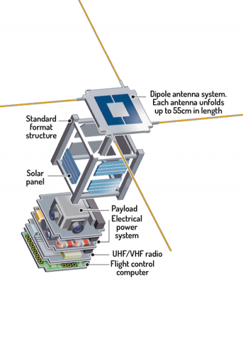

# CubeSat
Case study for Sparse MBSE Information Model



# WebView Model
https://coordinated-systems-lab.github.io/cube-sat/

# [GraphQL](https://graphql.org/) Model Exchange


* [Sparse MBSE GraphQL Schema](./graphql/mbse-metamodel.graphql)
* [CubeSat Case Study System Model](./graphql/earth-observation.json)

# GraphQL Playground
https://sim-graphql.vercel.app/

A few sample queries:
```
query Projects {
  cpsProjectsQuery {
    status {
      code
    }
    projects {
      id
      name
    }
  }
}
```
```
query Organizations {
  cpsSystemModelQuery (projectId: "f3d9d2c6-6332-47e4-910a-24514a5b5682") {
    cpsSystemModel {
      project {
        name
      }
      organization {
        identity {
          name
        }
      }
    }
  }
}
```
```
query UseCases {
  cpsSystemModelQuery(projectId: "f3d9d2c6-6332-47e4-910a-24514a5b5682") {
    cpsSystemModel {
      project {
        name
      }
      useCase {
        identity {
          number
          name
        }
      }
    }
  }
}
```
